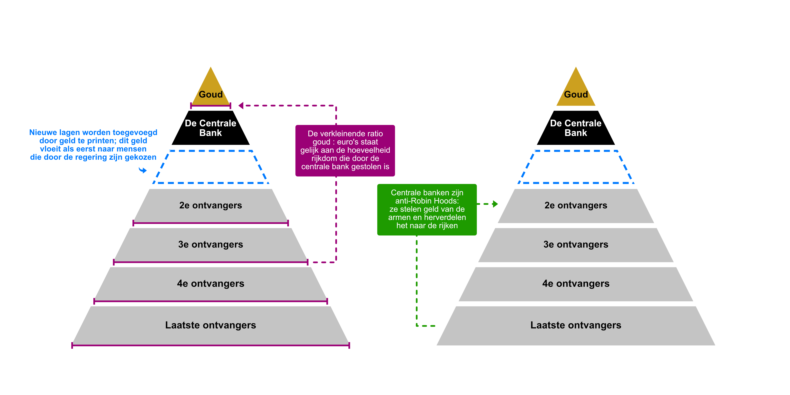

# Geld - Meesters en Slaven
Origineel door [Robert Breedlove](https://twitter.com/Breedlove22)
Vertaling door [Bitcoin Labrador](https://twitter.com/BitcoinLabrador)

Geld is een middel om tijd tussen mensen te verhandelen. Centrale banken, de meesters van het geld in de moderne tijd, gebruiken geld als wapen om tijd van mensen te stelen en ongelijkheid in rijkdom te creeëren. De geschiedenis laat ons zien dat corruptie in het monetaire systeem leid tot moreel verval, ineenstorting van samenlevingen en slavernij. De verleiding om het geldsysteem te manipuleren is altijd te sterk gebleken om te weerstaan; de enige manier om de verleiding te weerstaan is een geldsysteem maken dat niet te manipuleren valt – Bitcoin.

## Valsemunters zijn slavendrijvers
In West-Afrika werden aggry beads – kleine, kleurrijke glazen kralen – eeuwenlang gebruikt als geld. Deze kralen waren een manier om waarde tussen mensen over te dragen door handel (als geld) en over de generaties (als erfeniss of bruidsschat). Toen Europese ontdekkingsreizigers in de 16e eeuw Afrika binnenkwamen, was het snel duidelijk dat deze kralen een hoge waarde hadden voor de lokale bevolking. Glasblaastechniek was niet vergevorderd in Afrika, dus het maken van deze kralen was lastig. Hierdoor hadden de aggry beads een betrouwbare schaarste ten opzichte van andere goederen – iets wat de marktwaarde én de geschiktheid als geld ondersteunt.

In Europa was het glasblazen veel verder ontwikkeld; “neppe” kralen konden tegen zeer lage kosten geproduceerd worden. De Europeanen pakten de economische kans met beide handen aan en begonnen al snel expedities naar West-Afrika op te zetten. Ze namen gigantische hoeveelheden van (niet van echt te onderscheiden) kralen met zich mee. Deze expedities waren één van de eerste grootschalige vervalsingsoperaties in de geschiedenis. Uiteindelijk hadden ze een decennialange plundering van Afrikaanse rijkdommen, grondstoffen en – per saldo – tijd tot gevolg.  

De Europeaanse schepen kwamen vol met neppe kralen aan op de Afrikaanse kust, en de lokale bevolking verhandelden hun zuurverdiende bezittingen met ze. Zij dachten immers dat het schaarse en waardevolle aggry beads waren. Decennialang konden de Europeanen waardeloze en vervalste kralen ruilen voor de bezittingen van de Afrikanen, iets wat de Afrikaanse samenleving eeuwenlang zou verminken. Aggry beads zouden later bekend worden als slavenkralen; de bezittingen van de Afrikanen waren uitgeput en de Afrikanen zelf werden wanhopig. Sommigen hadden geen andere uitweg dan zichzelf of anderen als slaven te verkopen. De slavenkralen waren een belangrijk instrument in de Trans-Atlantische slavenhandel.

Jammer genoeg was deze plundering geen éénmalig fenomeen. Ook stukken stof – Panos – werden in het oude Afrika als geld gebruikt om met de moslim-culturen uit het noorden te handelen. De efficiënte productie van de Portugesen zorgde ervoor dat zij hetzelfde trucje uit konden halen en met de voor hen vrijwel waardeloze stukken stof de slaven konden kopen. Slaven die zij aan het werk zetten om diezelfde stukken stof in nóg grotere hoeveelheden te produceren.

Er viel een vrijwel oneindige hoeveelheid winst te maken, en de Portugese producenten kwamen bij elkaar in een monopolie die gesponsord werd door de Portugese staat: de Grão Pará en Maranhão Company. Dit bedrijf bekrachtigde het betalen van belastingen in Panos om de potientiële slaven in bedwang te houden. Om dit voorbeeld aan de huidige tijd te koppelen: jouw regering verplicht je om je belastingen in hun valuta te betalen. Je bent hier niet vrij in; belasting moet in de lokale valuta betaald worden, niet in goud, juwelen, of andere valuta. Ook de Verenigde Staten verdedigen de oliehandel in dollars met man en macht.

Omstandigheden die verdacht veel op de aggry beads of panos lijken gebeuren op dit moment ook in de moderne wereld. De dollar, euro of andere regeringsvaluta waar jij zo hard voor hebt gewerkt, kan vrijwel kosteloos worden bijgedrukt door jouw regering. De Verenigde Staten hebben bijvoorbeeld dit jaar (2020) biljoenen (1 000 000 000 000) dollars met een paar toetsaanslagen bijgedrukt. Op dezelfde manier dat de Europeanen makkelijker glas konden maken en zo het ‘geld’ van de Afrikanen konden vervalsen, hebben centrale banken het privilege om vrijwel kosteloos geld te produceren en zo beslag te leggen op de bezittingen van iedereen die dat geld gebruikt. De tactieken van de hedendaagse centrale banken zijn minder zichtbaar en minder gewelddadig, maar niet minder bedrieglijk dan de tactieken van de oude Europeanen in Afrika.

Er valt hier een belangrijke les te leren uit de geschiedenis: degene die een monopolie kan creeëren op de geldproductie wordt een de-facto valsemunter zich die tot in de oneindigheid de resultaten van de arbeid van anderen kan toe-eigenen. Wanneer de krachten die op de vrije markt werken gemanipuleerd kunnen worden, krijgen producenten een asymmetrische mogelijkheid om de prijzen van goederen vast te stellen, zonder daarbij de wensen van hun klanten in acht te hoeven nemen. Ze veranderen economische democratieën in dictaturen en vrijheid in tyrannie. Voor geld betekent dit dat de monopolist tijd (werk) kan verkrijgen tegen een te lage en oneerlijke prijs. Anders gezegd: geldmonopolisten kunnen tijd stelen – ze zijn slavendrijvers.

Een exclusief recht om geld te creeëren zonder marktconcurrentie is een apparaat voor slavernij – een privilege wat de monopolist alleen kan voortzetten door misleiding en geweld.

Vervalste aggry beads en panos waren wapens om menselijke tijd te verkrijgen; iets wat tussen 1501 en 1806 tot de diefstal van 12,5 miljoen mensenlevens heeft geleid. De trans-atlantische slavenhandel was een slow-motion holocaust voor de Afrikaanse bevolking; grofweg 2 miljoen Afrikanen storven onderweg naar Amerika, en degenen die het wel haalden waren de rest van hun leven onbetaald aan het werk. Om dit economisch te kwantificeren (zonder de mensen die in slavernij geboren zijn mee te tellen): als je er van uit gaat dat de gemiddelde slaaf 40 jaar lang 5000 uur per jaar kan werken, komt de hoeveelheid gestolen tijd uit op 2 500 000 000 000 uur, of 6.8 miljard uur per jaar verspreid over 365 jaar [bron](https://www.dropbox.com/s/zomgyj5hy0lc4zv/Slave%20voyages%20data.xls?dl=0).

> Slavernij is diefstal. Diefstal van een leven, diefstal van werk, diefstal van de eigendommen en productie, zelfs diefstal van de kinderen die een slaaf gebaard zou hebben.
> Kevin Bales

Als de geldproductie voor Afrika eerlijke concurrrentie had gehad, had deze verschrikkelijke periode in de geschiedenis misschien niet hoeven te gebeuren, of was het in ieder geval niet zo erg geweest. In een (niet-gewelddadige) vrije, concurrerende markt moeten producenten rekening houden met de wensen van hun klanten en met de mogelijkheden van hun concurrentie – dit zorgt ervoor dat ze moeten streven naar zo laag mogelijke prijzen en technologische innovatie. Zonder deze verantwoordelijkheid is het enige streven van producenten het verhogen van hun marktaandeel en zullen ze er alles aan doen om dit voor elkaar te krijgen – inclusief gewelddadige dwang.

## Markten, soevereiniteit en moraliteit
> Een actie kan alleen moreel zijn als hij vrijwillig is
> Murray N. Rothbard

Concurrentie is een natuurlijk proces van ontdekking. In de sport is het de manier waarop wij er achter komen welk van de twee teams of spelers tijdens een spel het meest competent is. Gedurende een heel speelseizoen wordt de beste speler gevonden door achtereenvolgend herhaalde spellen. In vrije markten is dit hetzelfde; ondernemers ‘spelen’ achtereenvolgende spellen van ‘wie kan het beste aan de wensen van de klant voldoen’. Iedere ondernemer wed met zijn investeringen in dat hij dat zelf is. Ze zorgen dat zij het beste aan de wensen voldoen door snellere, betere, makkelijkere of goedkopere oplossingen te bieden dan hun concurrentie. Concurrentie in de markt is wat eerlijk werk en echte maatschappelijke vooruitgang in de hand werkt. Een Amerikaans spreekwoord luidt: “onderzoek eindigt bij de waarheid”. Je kunt de vrije markt zien als een continu doorlopend onderzoek richting de waarheid. De ideeën en producten die de markt oplevert zijn onze beste benadering van de waarheid. 

Als je er pragmatisch naar kijkt, is de waarheid moeilijk te onderscheiden van hetgeen het meest nuttig is. Wanneer ideeën vrij uitgewisseld kunnen worden, wordt de waarheid gevormd door correcte prijzen, nuttige gereedschappen en individuele deugden. Prijzen zijn een weerspiegeling van de activiteiten en wensen van de mensen die meedoen in de markt; een afgeleide van ontelbare voorgaande handelsactiviteiten. Een gereedschap dat nuttiger is dat andere is een belichaming van de beste kennis die op dit moment beschikbaar is om een specifiek probleem op te lossen. Anders gezegd zijn ondernemers op zoek naar de waarheid door experimentatie en veranderen de goederen die ze produceren naar gelang de wensen van de klant totdat er een klein aantal oplossingen dominant worden in de markt. 

Ondernemers “scoren punten” voor het vinden van de waarheid door winst, en gestraft als zij de waarheid niet vinden doordat ze verlies lijden. Ze krijgen geld – het gereedschap om prijzen te berekenen, te onderhandelen en op de meest effectieve manier handel te drijven. Een vrije, competitieve markt houdt ondernemers eerlijk; wanneer het onderdrukt wordt door dwang of geweld (zoals met wettelijke monopolies) wordt de waarheid verwrongen, wat resulteert in verkeerde prijzen voor goederen, slechte gereedschappen en onethisch gedrag in individuen. Voor geldproducenten betekent het verkrijgen van een monopolie dat ze heerschappij over de tijd van de mensen die hun geld gebruiken krijgen.

In tegenstelling tot algemeen geaccepteerde wijsheid, is geld niet de wortel van al het kwaad. Geld is simpelweg een heel nuttig gereedschap om tijd te ruilen of op te slaan voor later (ik kan nu werk doen om geld te verdienen – ik verlies tijd – wat ik later uit kan geven, waardoor ik het product dat ik wil niet zelf hoef te maken en dus tijd win). Zoals ieder gereedschap heeft geld geen moraliteit. Gereedschappen zijn amoreel, ze kunnen zowel voor goed als kwaad gebruikt worden. De morele uitkomst van het gebruik van een gereedschap is hetzelfe als de intentie van de gebruiker ervan. Geld is een gereedschap om tijd te ruilen, maar zoals we hebben gezien kan het ook gebruikt worden om tijd te stelen; net als dat een hamer gebruikt kan worden om een huis te bouwen of een schedel in te slaan.

Een betere beschrijving is dat geld de wortel van alle soevereiniteit is (soevereiniteit wordt hier gedefinieerd als de capaciteit om te handelen zoals de persoon zelf het goed acht). Volgens de filosofie van [natuurrecht](https://nl.wikipedia.org/wiki/Natuurrecht) ligt soevereiniteit bij het individu, omdat ieder individu bewust voor zichzelf moet kiezen welke acties zij willen ondernemen – ongeacht welke invloeden van buitenaf zij ervaren. Iedereen heeft de bron van soevereiniteit in zich: de onschendbare principes van de logica, ook wel [logos](https://nl.wikipedia.org/wiki/Logos) genoemd. De logos is de laag tussen de twee primaire domeinen van beleving: orde en chaos. Tegelijkertijd is de logos het definiërende kenmerk van de mensheid; onze capaciteit om onze beleving en ervaringen als verhalen door te vertellen en om deze abstracte verhalen te begrijpen en geloven is wat mens van dier onderscheidt. Victor Frankl heeft deze geïnternaliseerde capaciteit de “laatste vrijheid van de mens” genoemd:

> De laatste vrijheid van de mens: de capaciteit om je houding in iedere situatie te kiezen, om je eigen weg ge gaan. En er zijn altijd keuzes te maken. Iedere dag, ieder uur, wordt je de gelegenheid gegeven om een keuze te maken. Een keuze die bepaalt of je jezelf wilt onderwerpen aan de machten die je de zeggenschap over jezelf, je innerlijke vrijheid willen afpakken. Keuzes die bepalen of jij een speelbal van de omstandigheden in je leven wordt en je vrijheid en waardigheid afgeeft. 

De woorden soeverein en regeren zijn aan elkaar verbonden. De meeste mensen op deze wereld zijn onderworpen aan een regering; of deze nu democratisch verkozen is of een koninklijke familie. De definitie van soevereiniteit is over de jaren heen minder en minder centraal geworden en dichter bij het natuurrechtelijke concept gekomen. Jordan Peterson schetst deze vooruitgang door de geschiedenis:

> Als eerst was de enige soeverein de koning. Toen werd de adel soeverein. Daarna alle mannen. Uiteindelijk werd mogelijk iedere individuele ziel soeverein. Dat idee van individuele soevereiniteit en individuele waarde is de kern van onze wettelijke en culturele systemen, en we lopen allemaal rond als waren we allemaal een goddelijk punt van de logos. We gunnen elkaar het respect van individuele burgers die soeverein zijn en gelijk voor de wet.

Het fundament van de hedendaagse westerse samenleving is dat individuele soevereiniteit een hogere waarde heeft dan de soevereiniteit van de staat. Dit ligt aan de kern van wettelijke principes zoals habeas corpus, onschuld tot schuld bewezen is en het recht tot vrijheid van meningsuiting. 

Vrijheid van meningsuiting is essentieel voor een vredige samenleving, omdat onze individuele ideeën vrij moeten zijn om met elkaar te botsen en conflicten op te lossen, zodat we dat niet lichamelijk hoeven doen. Taal en spraak ontwikkelde zich als een direct gevolg van onze evolutionaire ontwikkeling: toen we rechtop gingen lopen kregen we een groter blikveld. We hadden onze handen niet meer nodig voor onze voortbeweging, dus konden ze gebruikt worden om onze natuurlijke omgeving te bewerken. Onze duimen staan tegenover de andere vingers zodat we erg precies konden handelen; we konden bijvoorbeeld gereedschappen maken, of spullen sorteren en tellen. Precieze spieren in ons gezicht en tong evolueerde naast deze nieuwe nauwkeurigheid in onze handen, wat resulteerde in gesproken taal. Dit stelde ons in staat om de wereld nóg beter te categoriseren en maakte dat ons verstand de wereld nóg beter kon begrijpen (zelfs ons interne dialoog bestaat uit ‘gesproken’ woorden).

Onze capaciteit om met onze handen de wereld opnieuw in te delen versterkt onze abstracte capaciteit om de wereld verbaal in te delen; de twee vullen elkaar naadloos aan. Deze co-evolutie van vakmanschap en verbale articulatie leidde op een natuurlijke manier naar handel. Het meest verhandelbare goed in een handelssamenleving is haar meest waardevolle gereedschap; geld. 

Als je het op deze manier bekijkt is geld een directe afgeleide van vrije acties en vrije uitingen. Alle drie zijn ze essentiële media om je als soeverein persoon uit te drukken. Het gebruik van je geld is een manier om jezelf te uiten, net als dat je mening verkondigen dat is. Zo wordt geld een taal op zich – de taal van waarde-uitdrukking. Wanneer er beperkingen op deze uitingen worden gelegd (wat het doel is van centrale banken), is dit een catastrofale beperking op de vrijheid van meningsuiting (wat kan leiden tot absurditeiten als verboden getallen). Wanneer vrijheid van meningsuiting bestaat, kan tyrannie niet overleven; als het beperkt wordt, speelt het totalitaire regimes in de hand. De eerste actie van iedere aspirant-dictator zal zijn om iedere vorm van afwijkende gedragingen en meningen de nek om te draaien. Het licht van onderzoek en analyse dat uitgestraald wordt door de logos zal hij proberen te doven. In de 20e eeuw waren er vele regimes die de logos wilden onderdrukken. Twee voorbeelden:

> In 1917 kwamen de Russische bolsjewieken nog geen dag na de succesvolle staatsgreep in oktober in actie om de vrijheid van meningsuiting te beperken. Ze namen de het “Persbesluit” aan, dat iedere krant die “onenigheid zaaide door lasterlijke verdraaiingen van de feiten” dwong zijn deuren te sluiten. Op dezelfde manier begon de Nationaal-Socialistische Partij slechts een paar maanden nadat zij in 1933 aan de macht kwamen met het verbranden van boeken en werd Duitsland onderworpen aan strenge censuur door het Ministerie van Propaganda.

Logos (λόγος) is een grieks woord dat ‘ratio’ of ‘woord’ betekent. Het is het principe dat aan interpersoonlijke communicatie ten grondslag ligt, communicatie die voor het grootste deel via woorden en prijzen – (ruil)verhoudingen die zich uitdrukken in valuta – plaatsvindt. Zowel woorden als prijzen zijn verhoudingen die verschillende aspecten van de realiteit omvatten, uitdrukken, vergelijken en communiceren. Hierin ligt de macht van de goddelijke logos; het maakt orde van chaos. Kijk naar hoe woorden in de taal alleen betekenis hebben in relatie tot elkaar: alle woorden hebben definities die bestaan uit andere woorden. 

In (vrije!) markten is de prijs de uitdrukking van kruising tussen de objectieve hoeveelheid aanbod en de subjectieve hoeveelheid vraag. Het is een dynamisch gegeven dat de consensus van het collectieve logos van de markt weergeeft – iedere deelnemer aan de markt geeft ieder willekeurig goed een bepaalde waarde uitgedrukt in een ander goed (meestal in de gemeenschappelijke taal van de economie: geld), en de alle meningen over deze relatieve waarde bij elkaar genomen vormt de marktprijs.

Deze uitdrukking van relatieve waarde in geld wordt door regeringen verontreinigt wanneer ze het aanbod van geld (door inflatie) continu kunstmatig aanpassen terwijl ze tegelijkertijd vraag naar dat geld afdwingen door hún valuta het enige legale ruilmiddel te maken en belastingen in hun valuta te innen. Het verstoren van de natuurlijke prijsontwikkeling in de waarde van geld staat gelijk aan het verstoren van de collectieve logos van de samenleving en bederft de stem van het volk.

George Orwell zei ooit: “Als vrijheid ook maar iets betekent, betekent het ook het recht om mensen te vertellen wat zij niet willen horen.” Als de mogelijkheid om de waarheid te vertellen (in woorden) en om de waarheid in de markt te achterhalen (door prijzen) onmogelijk gemaakt wordt, betekent dit het einde van de vrijheid. De 20e eeuw heeft ons op pijnlijke wijze duidelijk heeft gemaakt dat het beteugelen van de logos en vrijheid van meningsuiting leidt tot totalitaire regimes; hoe goed de intentie van het beteugelen in eerste instantie ook mocht zijn. Vrijheid van uiting in alle vormen is een antecedent voor goede morele acties.

Zoals we eerder al hebben vastgesteld heeft geld noch spraak moraliteit vanuit zichzelf. Het economische karakter van geld geeft het echter wel invloed op morele waarden. De Buddha zei al: “Geld is de slechtste uitvinding van de mensheid, maar het is de meest betrouwbare maatstaf om menselijk handelen te toetsen.” Eerlijk geld moedigt rechtvaardig handelen aan, oneerlijk geld wekt moral hazard (moreel wangedrag) in de hand. Laten we naar een voorbeeld kijken om de invloed van geld op moraliteit beter te begrijpen. Beeld je een wijnboer in die in een staat met een centrale bank leeft. Hij weet dat de centrale bank onlangs de hoeveelheid geld heeft verdubbeld om “de economie te redden”. Hij heeft nu drie verschillende opties:

1.	Hij blijft zijn flessen wijn voor €10 per stuk verkopen, wetende dat de waarde van iedere euro is gehalveerd door de inflatie (dit is niet direct hoe inflatie werkt, maar het is goed genoeg voor dit voorbeeld)
2.	Hij kan zijn wijn met water aanlengen of druiven van slechtere kwaliteit gebruiken om zijn productiekosten (maar daarmee ook de kwaliteit van de wijn) te drukken. Hij blijft de de wijn voor €10 per fles verkopen
3.	Hij kan de wijn voor €20 per fles gaan verkopen om dezelfde hoeveelheid koopkracht voor zijn wijn terug te krijgen

Als de wijnmaker de eerste optie kiest, verliest hij 50% aan koopkracht ten opzichte van de situatie vóór de inflatie. Als hij de wijn verwatert, fraudeert hij door zijn klanten een inferieur product aan te bieden. Stel, hij is eerlijk en kiest voor optie 3. Als zijn concurrentie minder eerlijk is dan hij en voor optie 2 kiest, zal de eerlijke wijnboer al zijn klanten verliezen omdat de vermindering in kwaliteit van de wijn niet opgemerkt zal worden door de meeste mensen die geen connoisseur zijn. 

Het verwateren van de wijn levert een onmiddelijk financieel voordeel op zonder dat dit zich evenredig kenbaar maakt in het verlies van klanten. Dit levert een natuurlijke stimulans op om fraude te plegen richting je klanten in een economisch systeem waar inflatie de norm is. Dergelijke wijnschandelen zijn [daadwerkelijk voorgevallen](https://en.wikipedia.org/wiki/1985_diethylene_glycol_wine_scandal).

In iedere industrie waar inflatie aanwezig is kunnen bedrijven kiezen tussen het ontslaan van werknemers, failliet gaan of hun klanten bedriegen. Financiële welvaart moet worden afgewogen tegen morele integriteit. Op deze manier is inflatie een ziekte die het morele weefsel van onze samenleving infecteert. Geld wat niet of minder onderhevig is aan inflatie is op zijn beurt weer een medicijn voor een samenleving getroffen door de inflatie-ziekte. Met dit ongelofelijk belangrijke besef kun je zeggen dat Bitcoin – de enige vorm van geld dat uiteindelijk geen inflatie kan en zal hebben – één van de (zo niet hét) geneesmiddelen kan zijn voor het morele verval van onze samenleving.

Geld is een grote bron van verleiding, omdat een soort register is van wie wat bezit – je kunt geld immers gebruiken om vrijwel letterlijk alles te kopen wat je zou willen. Wanneer een groep met unieke privileges (ook wel: monopolie) geld uit het niets kan scheppen, kunnen zij het “wie bezit wat”-register naar willekeur aanpassen. Ze kúnnen het niet alleen, ze hebben ook een sterke stimulans om dit daadwerkelijk te doen voor hun eigen gewin. De eigenschap van geld als eigendomsregister laat zien wat de onderliggende impuls van centrale banken – de instituen die zichzelf zien als de voogd van de eigendomsregisters met een exclusief privilege om de belangen van hun aandeelhouders te behartigen; zelfs wanneer dat betekent dat ze slaven maken van alle andere mensen.

Aangezien de productie van ieder product op de markt een opoffering van menselijke tijd vereist, kunnen we zeggen dat geld een vertegenwoordiging is of symbool staat voor de tijd die mensen opofferen. Op dezelfde manier dat een aandeel symbool staat voor aanspraak op (een gedeelte van) het kapitaal van een bedrijf, is geld een aanspraak op tijd. Mensen offeren hun tijd op voor geld wat ze later aan evenredige offers van andere mensen kunnen besteden. Het mag duidelijk zijn dat een gereedschap wat de opgeofferde tijd van mensen kan beheersen zowel een grote verleiding als een bron van vermogen en macht (in de natuurkundige zin: arbeid over tijd). Een lust naar macht is de motivatie achter de meeste oorlogen – over het algemeen is een oorlog het inzetten van fysieke en gewelddadige macht om kapitaal, voedsel, mensen of territorium toe te eigenen. Een gebrek aan macht is sterk verwant aan ongelukkig zijn, wat het vergaren van macht aantrekkelijk maakt.

> Geen enkele slaaf is gelukkig. Bestaat er een groter ellende voor een mens dan te leven zonder macht over wat dan ook, zichzelf inbegrepen?
> Philo Judaeus

Geld is altijd een onmisbaar onderdeel van zowel het idee van soevereiniteit als dat van slavernij geweest. Wanneer het geld door de bevolking gekozen is door het proces van vrije markten, is het geld een samenwerking van het collectieve logos van het volk; een verbinding van alle individuele soevereine uitingen. Maar natuurlijk geld is gekaapt door kunstmatige tyrannen; de enige reden waarom staten soeverein zijn is omdat zij het meeste échte vrij gekozen geld hebben: goud.

## De zogenaamde soevereine staten
> Ik wist niet dat ik een slaaf was totdat ik ontdekte dat ik de dingen die ik wilde doen, niet kon en mocht doen.
> Frederick Douglass

Al zo’n 5000 jaar lang zijn edelmetalen door de vrije markt gekozen als geld, omdat zij het beste aan de vijf essentiële kenmerken van geld (verdeelbaarheid, duurzaamheid, draagbaarheid, herkenbaarheid en schaarste) voldeden. Goud was hier het meest gewild, omdat het het schaarst was. Het valt goed te onderbouwen dat schaarste het belangrijkste kenmerk is waar geld aan moet voldoen. Zonder zekerheid dat de hoeveelheid, of het aanbod van, geld niet makkelijk groter kan worden, is er altijd iemand met een sterke motivatie om dat aanbod te vergroten en zichzelf te verrijken ten koste van de andere gebruikers (zie: aggry beads, panos en het huidige papiergeld van regeringen). 

Regeringen hebben zich altijd bemoeid met de geldmarkt, bijvoorbeeld door zich het recht om geld te munten toe te eigenen. Een gestandaardiseerde munt heeft immers veel voordelen ten opzichte van een goudklompje; je weet precies hoeveel het is, het is makkelijker draagbaar en je kunt één gouden munt “verdelen” over meerdere zilveren munten. Doordat regeringen een monopolie op het certificeren van munten afdwongen, werd de last van het vertrouwen verschoven; hiervoor moesten de twee partijen die met elkaar handelden elkaar vertrouwen, nu hoefden ze alleen op de regering te vertrouwen. De staat heeft over de geschiedenis altijd geprobeerd om zich het exclusieve recht van het bepalen van de waarde van geld toe te eigenen. Onthoud dat een gebrek aan concurrentie in iedere markt het natuurlijke proces van het bepalen van de waarheid (in dit geval: de prijs of waarde van het geld) verstoort. Dit is de reden dat vertrouwen in monopolies uiteindelijk altijd verdwijnt.

Alle nationale valuta begon ooit als een papieren belofte, een claim op ‘echt’ geld (goud of zilver). Vandaag de dag kun je je valuta niet meer inwisselen voor echt geld, en zijn deze valuta veranderd in niet meer in te lossen beloftes genaamd “fiat” geld (fiat is latijn voor ‘laat het zo zijn’, dit betekent in dit geval dat de enige waarde die het geld heeft berust op regeringsbesluit). Regeringen eisen van de samenleving dat zij exclusief handelen in hun valuta; een restrictie op het collectieve logos. Ze hebben zich hiermee het recht om de tijd van hun burgers te stelen toegeëigend. Onder fiat geld heeft de samenleving de regering een lening aangeboden. Een lening waar de regering geen onderpand voor heeft gegeven. Een lening die de regering niet terug kán of zal betalen. Tegelijkertijd nemen de reserves van écht geld – goud – die centrale banken hebben [gestaag toe](https://centralbankgold.org/reserve-statistics) en betalen de banken onderling wél met dit authentieke geld.

Zo bekeken is het printen van geld daadwerkelijk het vervalsen van geld – banken produceren valse beloftes, omdat de valuta niet meer gekoppeld is aan echt geld. Simpel gezegd is fiat geld een levende leugen. Ongeacht of je geld een gereedschap of een wapen acht, is het manipuleren van valuta altijd nuttig voor het produceren van ongelijkheid in rijkdom door het stelen van tijd. Ieder gereedschap is een wapen als je het op de juiste manier hanteert, en het vervalsen van geld is een zeer effectief wapen.

In oorlogstijden hebben ruzieënde landen vaker geld als wapen ingezet. Nazi-Duitsland had bijvoorbeeld plannen om Engeland te [‘bombarderen’ met nepgeld](https://nl.wikipedia.org/wiki/Operatie_Bernhard).  In keizerlijk Japan experimenteerde het Noborito Laboratorium ook met het vervalsen van geld om de economieën van hun tegenstanders te saboteren. In vredestijd is het vervalsen van geld alleen weggelegd voor centrale banken, wiens monetair beleid de geldstapel ieder jaar verhoogt; de hoeveelheid euro’s is sinds 2002 [bijna verdrievoudigd](https://sdw.ecb.europa.eu/browseExplanation.do?node=9691573).

Dat wil zeggen dat de hoeveelheid geld ieder jaar met zo’n 5,6% is toegenomen. Met andere woorden, de Europese Centrale Bank steelt ieder jaar 5,6% van iedereen die euro’s heeft, en herverdeelt het naar iedereen die huizen, aandelen of andere schaarse middelen bezit.

Natuurlijk is het ook zo dat mensen dingen als goud zullen aanschaffen als de situatie onzekerder wordt. Fiat-geld is immers alleen de belofte om later geld te ontvangen, waardoor je het risico loopt je geld te verliezen. De soevereine staat heeft een bedrijfsvoering gebaseerd op de confisquatie van soevereine geldmiddelen als goud en zilver. 

## De Piramides
> Er zijn twee manieren om een land te veroveren: met het zwaard, of met schulden.
> John Adams

Het is beroemd voor de pyramides die gebouwd zijn door duizenden slaven; het oude Egypte uit de bijbel is een typisch voorbeeld van een tyrannie. De grootsheid van deze gebouwen heeft veel te danken aan de tijd die van slaven gestolen werd door de Pharaohs. Het boek ‘Heroes of History’ van Will Durant geeft goed weer hoeveel werk het heeft gekost om deze monumenten te bouwen:

> “Volgens Herodotus... heeft de pyramide 20 jaar lang het werk van 100,000 man gekost.”

Om deze hoeveelheid tijd preciezer te kwantificeren gaan we er weer van uit dat een slaaf 5000 uur per jaar kan werken. De mankracht die aan één pyramide heeft gewerkt staat gelijk aan 10 miljard manuur die de Pharaohs gestolen hebben. Een schokkende hoeveelheid tijd. Nog schokkender is dat het grootste pyramidespel uit de wereldgeschiedenis – fiat geld – nog véél meer tijd steelt dan de pyramides of de trans-atlantische slavenhandel. Zoals Henry Ford zei:

> Het is maar goed dat de mensen uit dit land ons banken- en monetaire systeem niet begrijpen. Als ze het zouden begrijpen, vrees ik dat er nog vóór morgenochtend een revolutie zou zijn.

Een pyramidespel is een soort oplichting waarbij er een hiërarchische investeringsopstelling wordt gebruikt. De mensen die als eerste instappen worden betaald met de investering van de mensen die later instappen, waarbij de aanname is dat er in iedere ‘laag’ steeds meer mensen instappen om aan iedereen winst uit te betalen. Fiat geld is een pyramidespel van centrale banken. Ze onderdrukken goud als geld, wat normaal gesproken door de markt gekozen zou worden aangezien het oneindig veel schaarser is en dus zijn waarde niet verliest. 

Na langdurig gegoochel van regeringen leeft nu vrijwel de hele wereld onder een regime van fiat geld. Fiat geld is geld wat gebaseerd is op schulden dat alleen dankzij geweld en dwang gebruikt wordt; hetzelfde fenomeen als dat we eerder beschreven bij het Portugese Grão Pará en Maranhão Company. Het ergste is dat de armste mensen uit de samenleving het zwaarst getroffen worden door deze oplichting. Als je arm bent, heb je relatief gezien meer geld dan rijkere mensen. Arme mensen huren hun huis en leven van loonstrook tot loonstrook. Rijkere mensen hebben hun geld vaak in hun huis, aandelen, obligaties, etc.

Bovenaan de fiat pyramide staat goud: een ‘technologie’ geselecteerd door de opgetelde vrije keuzes (de collectieve logos) van ontelbare handelaars en ondernemers door de geschiedenis heen. Een papieren vertegenwoordiging van goud was bedoeld om de ruil van goud makkelijker te maken, niet om het te vervangen. Later werd de mogelijkheid om deze papieren in te wisselen voor geld weggehaald, waarna de regering de volledige controle over de schaarste van valuta had – en dus ook een ongelimiteerde capaciteit om de rijkdommen van haar onderdanen te stelen.

Iedere keer dat er één euro wordt bijgeprint (wat eufemistisch omschreven wordt als ‘kwantitatieve versoepeling’ door de centrale bank), wordt er een nieuwe laag aan de fiat-pyramide toegevoegd en worden de kosten van inflatie op iedereen die euro’s in zijn zak of op zijn bankrekening heeft afgewenteld. Het wordt nog erger, omdat iedere euro die geprint wordt gebruik kan maken van een hefboomeffect (één euro kan meerdere keren uitgeleend worden). Als we nu specifiek naar de Fed, de Amerikaanse Centrale bank, kijken, zien we het volgende: ieder jaar keert de Fed een dividend van 6% uit aan de (onbekende) aandeelhouders. De Fed gebruikt de nieuw geprinte dollars om schulden van de Amerikaanse regering op te kopen. De regering gebruikt dit op zijn beurt weer om de bureaucratie te bekostigen. 

#### Regeringen werken samen met centrale banken om het fiat geld te verwateren door steeds meer te printen; ze voegen steeds meer lagen aan hun piramides toe.

Zo lang als dat mensen passief, maar tegelijkertijd productief genoeg, blijven, is er niets aan de hand voor het pyramidespel en kan de politiek en de centrale bank doorgaan met geld en tijd stelen van normale mensen. Dit kan echter niet voor altijd door blijven gaan. Iedere laag die er op de pyramide gebouwd wordt, zorgt ervoor dat mensen verder achter de feiten aan gaan lopen. Prijzen gaan omhoog, lonen blijven gelijk of gaan in ieder geval niet net zo hard omhoog en je krijgt al helemáál geen rente op je spaargeld, wat ieder jaar een paar procent van zijn waarde verliest. Dit zorgt ervoor dat mensen langzaam maar zeker hun vertrouwen in het geld verliezen. Net zoals Hemmingway faillissement beschreef: het gebeurt langzaam, en dan ineens. Inflatie wordt zéér plotseling vervangen door hyperinflatie; een totale melt-down van het economische vertrouwen dat door geld gecreeërd zou moeten worden. 

#### De fiat-piramides kunnen oneindig hoog gebouwd worden, zo lang de samenleving er vertrouwen in heeft. Maar dat vertrouwen is de énige fundering waar de piramide op gebouwd is, en hoe hoger de piramide, hoe hoger de kans dat dat vertrouwen wegvalt.

Gelukkig hebben we Bitcoin. Bitcoin zorgt ervoor dat dit financiële pyramidespel niet meer beschermd kunnen worden tegen concurrentie. Al het fiat geld berust op de aanname dat banken concurrentie in de doofpot kunnen stoppen. Centrale banken hebben zo’n 20% van de totale hoeveelheid goud op aarde, wat ze grote invloed over de goudprijs geeft. Zonder interventie zou fiat geld snel vervangen worden door goud; de geschiedenis leert ons dat mensen altijd het meest schaarse geld willen hebben, omdat het de waarde beter vasthoud. Op dit vlak is Bitcoin – vaak aangeduid als digitaal goud – een gigantische doorbraak. Het is een monetaire technologie die zelfs met het eeuwenoude goud kan concurreren op alle belangrijke vlakken en niet onderdrukt kan worden door centrale banken.

### Bitcoin is Digitaal Goud - het enige onbederfbare geld
#### Iedere laag van de Bitcoin piramide is gemaakt van echt geld, niet van papieren beloftes. Doordat er maximaal 21 miljoen bitcoin zijn, is er geen enkele vorm van onbekende inflatie

Alle soorten geld nemen een pyramidevorm aan. Voor Bitcoin geldt dit ook; in dat geval betekent het dat de ‘early adopters’, de mensen die als eerste hun fiat geld risqueren, meer profiteren van het syteem dan de mensen die als laatste instappen. Het kan omschreven worden als een [virtueuze (in plaats van vicieuze) cirkel](https://twitter.com/Breedlove22/status/1251309365337960452/photo/1).  Het verschil tussen Bitcoin en fiat-geld is dat er nooit meer dan 21 miljoen bitcoin kunnen zijn, terwijl er een oneindige hoeveelheid fiat-geld kan zijn. Het resultaat is dat ‘early adopters’ van fiat-geld oneindig door kunnen kunnen gaan met profiteren zonder risico, terwijl de early adopters van Bitcoin éénmalig profiteren en hier ook risico voor hebben genomen (ze weten immers niet zeker dat Bitcoin zal werken en ze het dus later uit kunnen geven aan de dingen die ze willen, en ze weten wel zeker dat ze hun fiat geld op dit moment uit kunnen geven).

Bitcoin is een symmetrisch systeem dat gekenmerkt wordt door perfecte informatie; een systeem waarin iedereen die participeert over dezelfde hoeveelheid informatie beschikt en precies weet wat de regels van het syteem zijn (denk aan schaken; beide spelers weten precies aan welke regels ze zich moeten houden). Iedereen die Bitcoin heeft kan bijvoorbeeld zelfstandig verifiëren dat er maar 21 miljoen bitcoin kunnen zijn zonder te vertrouwen op wat iemand anders ze vertelt. Perfecte informatie is een benodigdheid voor perfecte concurrentie, een ideale (maar praktisch onhaalbare) situatie in de markt waar competitie volledig onbellemmerd is door onnodige wetten en de totale hoeveelheid welvaart maximaal is. Bitcoin belooft dichterbij dit ideaal te komen door de scheiding van geld en staat.

Neergelegd in nette, permanente lagen, blinkt het digitale goud veel mooier dan de onzekere schijn van fiat geld. Geld wordt ook wel beschreven als een ‘verzekering tegen onzekerheid’ (met geld kun je van alles, met je aankoop maar één ding), en de vraag naar geld is dus direct gerelateerd aan de zekerheid van de monetaire eigenschappen van het geld. Bitcoin is het beste in alle vijf eigenschappen van geld: het is op te delen in 100 miljoen deeltjes (verdeelbaarheid), het is duurzaam (alle bitcoin worden wereldwijd opgeslagen op tienduizenden computers), alle 21 miljoen bitcoin passen in je broekzak (draagbaarheid) en het is net zo herkenbaar als ieder ander stuk informatie. Verder bezit het een gigantische hoeveelheid schaarste; er kunnen er immers nooit meer dan 21 miljoen zijn. Bitcoin is een zwart gat gebouwd op speltheorie wiens zwaartekracht de wereldwijde markt niet kan ontsnappen. Dit gebrek aan mogelijkheid tot ontsnappen leidt, paradoxaal genoeg, tot de bevrijding van meer en meer fiat-slaven over de hele wereld.

#### Piramides van fiat-geld worden naar mate de tijd vordert steeds hoger en minder betrouwbaar, en iedere fiat piramide zal langzaam maar zeker uit elkaar vallen wanneer de gebruikers kiezen voor betrouwbaar geld.

De Bitcoin-piramide heeft een vooraf vastgestelde hoogte, vastgesteld in de absolute schaarste van 21 miljoen. Dit zorgt ervoor dat Bitcoin steeds meer en beter concurreert met het fiat-piramidespel, dat juist steeds minder schaars en steeds minder betrouwbaar wordt. Uiteindelijk valt dit kaartenhuis in elkaar, en zal alleen de volledige transparantie en zekerheid van Bitcoin blijven staan. 

Als we het zo bekijken is er hoop voor de wereld, omdat er eindelijk een soort geld is waarvan je precies alle attributen kunt weten. Het is een corruptie-proof alternatief op het volledig onethische systeem van centrale banken. Bitcoin is eerlijk geld wat de wereld kan redden van de leugens van fiat geld.

Op een manier zou je Bitcoin kunnen zien als de lapis philosophorum, de ‘onverderfelijke’ substantie die als medicijn tegen corruptie zou dienen, waar de oude alchemisten naar op zoek waren. Jordan Peterson schreef over alchemie in zijn boek “Maps of Meaning”:

> De volgorde van alchemische transformatie staat parallel aan het lijden van Christus, parallel aan de mythe van de held en zijn verlossing. De boodschap van alchemie is dat individuele en persoonlijke afwijzing van tyranny, de vrijwillige achtervolging van wat onbekend en angstaanjagend is, kan leiden tot een persoonlijke transformatie die zo overweldigend is dat het alleen maar teruggevonden kan worden in de meest diepgaande religieuze mythes. De lapis philosophorum is een middel van transformatie, gelijk aan de mythologische verloste held, met de capaciteit om gewoon metaal in goud om te zetten. Het is zo waardevoller dan goud, net als dat de held waardevoller is dan wat hij concreet meemaakt.

Alchemische methodieken waren proto-wetenschap; experimentele processen die duizenden jaren lang verbeterd zijn en uiteindelijk zouden leiden tot de wetenschappelijke methode. Als gedachtegoed was de alchemie een afsplitsing van de kerk, gebouwd op het geloof dat verlossing gevonden kon worden in het laboratorium dat de natuur is (een ketterse manier van denken, toentertijd). Aan de voorhoede van technologische prestaties van de mensheid staat Bitcoin, een soort geld dat niet gemanipuleerd kan worden en wat mensen vaak serieuze persoonlijke veranderingen doet doormaken. Misschien is Bitcoin inderdaad het lapis philosophorum dat mensen aanzet tot rebellie tegen de tyrannie van de staat en zo de mensheid dichterbij god te brengen. Bitcoin is waarheid, en God wordt soms gedefinieerd als het spreken van waarheid dat ziekelijke hiërarchiën ongedaan maakt. Of, zoals Benjamin Franklin zei:

> Verzet tegen tyrannie is gehoorzaamheid aan God.

Net als vrijheid, liefde en waarheid, is God tijdloos. Ik heb het hier niet over de “man in de lucht”: het eeuwenoude idee uit Genesis is dat God de kracht is die de chaos van de wereld confronteert met moed, waarheid en liefde en het omzet in goede en nuttige orde. Wij zijn gemaakt naar God’s gelijkenis, en we zijn soevereine individuen die onze eigen logos hebben, een kracht die verantwoordelijk is voor onze capaciteit om de chaos van de natuurlijke wereld om te zetten in een leefbare ruimte. Onze toekomst is geplant in onze fantasie, een realiteit die wij zelf kunnen creeëren door onze logos te gebruiken in gedachten, spraak en acties. De logos is de goddelijke vonk in ons allemaal; we zouden kunnen zeggen dat God het anti-entropische principe is wat eeuwig ten grondslag ligt aan al het leven.

> Iets wat dood is kan met de stroom meegaan, maar alleen iets levends kan er tegenin gaan.

Om als individu op de meest waarheidsgetrouwe manier de logos te kunnen belichamen en collectief de tijdloosheid van God te benaderen, moeten we ons verzetten tegen de tyrannie van de machten die constant met het openbare geheim van inflatie onze tijd stelen.

## Het Stelen van Tijd
> Er is één soort dief die niet wordt vervolgd door de wet, en die tegelijkertijd het meest waardevolle goed van de mensheid steelt: tijd.
> Napoleon Bonaparte

Veel mensen leggen de schuld van de hedendaagse economische problematiek per vergissing bij het kapitalistische systeem. Echter staat er juist een socialistisch instituut aan het hart van iedere moderne economie: de centrale bank. De eerste man die een hut bouwde om zichzelf te beschermen tegen de regen was in essentie de eerste kapitalist. De man die als eerste het hutje van de andere betrad en het zich toe-eigende was de eerste socialist. Capitalisme betekent vanuit beginsel dat iedereen het exclusieve recht heeft op de resultaten van zijn eigen werk. Met andere woorden: iedereen is eigenaar van zijn eigen tijd. Kapitalisten zijn vrij om de waarde die zij hebben gecreeërd met hun tijd (zij het goederen, diensten of kennis) te verhandelen met andere soevereine individuen die hetzelfde doen. Daar tegenover staat socialisme; wat inhoudt dat de regering (m.a.w.: andere mensen) zich een gedeelte van jouw tijd toe-eigenen door middel van dienstplicht, het heffen van belastingen of door middel van inflatie.

Socialistisch fiat-geld is het levensbloed dat door de aderen van de tyrannie van de staat vloeit. Om te bevatten hoe kolossaal de diefstal van centrale banken is geworden, kunnen we terugkijken naar de hoeveelheid euro’s die de ECB heeft geprint. Als we een gemiddelde van [36,2 werkuren per week](https://ec.europa.eu/eurostat/statistics-explained/index.php?title=Hours_of_work_-_annual_statistics) nemen  betekent dit zo’n 1880 werkuren per jaar. Over een gemiddeld salaris van [€2330 per maand](https://www.reinisfischer.com/average-monthly-salary-european-union-2020) komen we uit op een gemiddeld uurloon van €14,87. Wanneer we dit gebruiken om het aantal gestolen uren te berekenen (de ‘huidige’ hoeveelheid euro’s min de hoeveelheid euro’s aan het begin van 2002 gedeeld door het uurloon), komen we uit op bijna 584 miljard manuur dat de ECB tussen januari 2002 en augustus 2020 heeft gestolen. Dat komt neer op ruim 33 miljard manuur per jaar. Dit staat gelijk aan het tot slaaf maken van 17,5 miljoen mensen op jaarbasis – ruim de volledige Nederlandse bevolking.

#### In het groen de hoeveelheid Euro's, in het rood de hoeveelheid gestolen tijd in uren

Laten we even teruggrijpen naar de Trans-Atlantische slavenhandel, die 6,8 miljard manuur per jaar kostte. De ECB steelt ieder jaar bijna 5 keer zo veel tijd als wat de meeste mensen als één van de zwartste bladzijden uit onze geschiedenis zouden bestempelen. De ECB zou ieder jaar ruim drie pyramides kunnen bouwen. 

Deze impliciete vorm van belasting op de bevolking – die bovenop de normale, expliciete, belasting komt – is een vorm van socialisme. Socialisme voor de ECB en regeringen. Tenzij een transactie vrijwillig en bewust gedaan wordt, is de transactie uitbuiting; een belangrijk centraal punt van vrije-markt kapitalisme waar de ECB niet aan meedoet. Fiat geld is het grootste pyramidespel en het grootste instituut van slavernij uit de wereldgeschiedenis.

Zodra we de centrale banken niet meer zien als een economisch maar als crimineel instituut, komen we dichter bij het échte plaatje. Kapitalisme heeft zijn basis in de waarheid (hard werk, het uitstellen van voldoening en eerlijke handel), terwijl socialisme zijn basis kent in leugens (bureaucratie, propaganda en diefstal). Net als neppe aggry beads en panos worden “neppe” (maar wel officiële) euro’s gebruikt om het militaire complex in stand te houden. Voor fiat geld moest het leger van een land onderhouden worden door middel van expliciete belastingen of het lenen van geld. Socialistisch geld is een manier om ongemerkt gruweldaden te financieren. Iedere dictator, wereldoorlog en concentratiekamp in de wereldgeschiedenis is door fiat geld gefinancierd. Alleen al in de 20e eeuw hebben fiat regeringen [169 miljoen mensen gedood](https://www.hawaii.edu/powerkills/DBG.CHAP1.HTM): 

De geschiedenis schetst een duidelijk beeld: wereldwijd gedwongen gebruik van fiat geld leidt tot het verlies van mensenlevens op een verschrikkelijke schaal. Simpel gezegd is socialisme een vorm van fraude, en de mensen die stil blijven over de waarheid van wat centrale banken écht zijn, zijn net zo schuldig aan hun criminele daden.

> Als je fraude ziet, en geen “Fraude!” roept, ben je een fraudeur.
> N. N. Taleb

Het centraal organiseren van geld is geen nieuw idee. In Marx’ Communistisch Manifest uit 1948 beschrijft hij de volgende maatregel: “Centralisatie van crediet in de handen van de staat, door middel van een nationale bank met het kapitaal van de staat en een exclusief monopolie op de bankensector”. Centrale banken zijn een pagina uit het draaiboek van de vader van het Communisme; er is niets kapitalistisch aan. [Centrale banken zijn monetair socialisme](https://mises.org/wire/why-marx-loved-central-banks)  en een instituut van financiële onderwerping. Marx was zelf ook een [bekend racist](https://www.dailysignal.com/2017/05/10/ugly-racism-karl-marx/)  en zijn systeem van centraal georganiseerd geld was ontworpen om de welvaart van de “minderen” te herverdelen naar de staat en de mensen die het wél verdienden. Het mag geen verassing zijn dat een instituut geboren uit Marx’ filosofieën ook nu de vorm van een racistische slavendrijver heeft aangenomen. 

Slavendrijvers willen de vruchten plukken dat het werk van anderen heeft opgeleverd, zonder dat zij hier zelf de benodigde offers voor hoeven te brengen. Vrijwel alle handels-samenlevingen gebruikten uiteindelijk goud als ruilmiddel, omdat het ‘bewijs van arbeid’ in zich had; een onvervalsbare kostbaarheid die het collectieve werk om het te bemachtigen vertegenwoordigt. Alle innovaties die de mensheid gedaan heeft zijn verbeteringen in menselijke productiviteit – gereedschappen om grotere, betere resultaten te behalen, zonder meer arbeid te hoeven verrichten. Diefstal is het tegenovergestelde; het vervormd de morele stof van de realiteit om de ego te dienen. Dit soort pogingen om de realiteit te verdraaien keren zich altijd tegen de mensen die het proberen, en onze enige verlossing van dit soort bedrog is de waarheid.

Geld is een sociaal construct, een gereedschap dat de mensheid heeft bedacht om op dit moment tijd op te kunnen offeren en het op te kunnen slaan voor later. Schulden zijn het tegenovergestelde; je leent tijd van je latere zelf om er nú van te kunnen genieten. Echt geld is de enige manier om schulden echt af te betalen. Fiat geld is tegengesteld aan het concept van geld, omdat het in leven geroepen wordt door een schuld aan te gaan. Dit zien we dan ook terug: de fiat-economie heeft zichzelf volgepropt met schulden, en de dag des oordeels zit eraan tekomen. De economische realiteit eist dat schulden afbetaald worden.

Een integraal element van het sociale contract is dat wij de tijd die we nu uitgeven kunnen inwisselen voor geld dat we later weer kunnen ruilen voor goederen of diensten die in verhouding staan met die hoeveelheid tijd. Wanneer het vertrouwen in deze afspraak over tijd vervalt omdat tyrannen de samenleving leegroven door inflatie, valt de samenleving in duigen. Fiat is het ultieme instrument van het kwaad in de wereld, een wapen dat de bezittingen van meerdere generaties kan onteigenen, gehanteerd door slimme slavendrijvers op hun nietsvermoedende onderdanen.

## Moderne Slavendrijvers
De dynamiek tussen meesters en slaven hebben bijna altijd met ras of cultuur te maken. Een feit dat niet veranderd is in onze moderne ‘beschaafde’ tijd. Ook hier in Europa voelen we de onrust die ontketend is door de moord op George Floyd, een zwarte man die midden op straat vermoord is door vier politieagenten terwijl zijn medeburgers hulpeloos toekeken.

We zeiden al eerder dat de waarheid het einde van het onderzoek was. In het digitale tijdperk kunnen we met z’n allen oneindig veel meer zien en veel verder kijken dan ons eigen blikveld. Het licht van onderzoek wordt hierdoor in alle donkere hoeken en gaten van de samenleving geschenen. Dit aspect van ons digitale leven werkt als een versterker op de waarheidsvindende functie van vrije markten. Bedenk bijvoorbeeld de rol die digitale technologieën gespeeld hebben in de Arabische Lente, Wikileaks en nu de protesten die wereldwijd zijn uitgebroken rondom de moord op George Floyd. Toen Martin Luther Kind in 1965 een protest tegen ongelijk stemrecht leidde, werd er ook hardhandig ingegrepen door de politie. Dit was al vaker gebeurd, maar er was één verschil: nu werd het op televisie uitgezonden. Dat had een significante invloed op de uitkomst van dit protest; doordat de hele wereld toekeek hoe de politie een vredig protest uit elkaar sloeg, werd de regering van de VS al snel gedwongen om de wetten die de apartheid in stand hielden te ontbinden.

Vrije-markt kapitalisme is een sociaal systeem waarin we met zijn allen de wereld door zo veel mogelijk ogen zien (door middel van woorden en prijzen), waardoor het beeld wat we van de wereld krijgen zo scherp en zo accuraat mogelijk is. In het digitale tijdperk wordt dit versterkt door smartphones, social media en live-streaming. Hierdoor wordt ons collectieve bewustzijn nog verder ontwaakt. De waarheid is dat er duizenden tragische verhalen als dat van George Floyd zijn voorgevallen, maar net als in 1965 is er nu een belangrijk verschil: live beelden van de misdaad worden direct over social media verspreid en zo kunnen er ontelbaar veel mensen meekijken, zonder dat dit makkelijk gecensureerd kan worden. In de huidige stand van zaken kan de moord op één man een opstand van fiat-slaven over de hele wereld ontketenen. 

De waarheid is dat de politie er is om het “eigendom” van de staat te beschermen. Zij bewaken de lieve vrede, terwijl de staat doorgaat met het wettelijk confisqueren van de tijd van hun fiat-slaven. De politie in de VS begon als “slavenpatrouilles” die slavendrijvers hielpen met het terugvinden en straffen van hun “eigendom”. 

Centrale banken zullen uiteindelijk ten onder gaan, omdat we nu meer gereedschappen dan ooit hebben om leugens te ontmaskeren. De centrale bank heeft onwetendheid, angst en de onderdrukking van vrije keuzes nodig om te blijven bestaan; het kan de onderzoekende blik van de samenleving die in onze huidige digitale samenleving aanwezig is niet eeuwig weerstaan. Gecentraliseerde valsemuntersoperaties zullen niet getolereerd worden in een wereld waar er een ongekende hoeveelheid toegang tot kennis is. George Floyd werd gearresteerd omdat hij een vals biljet van $20 probeerde te gebruiken; hetzelfde misdrijf als dat centrale banken op een ongekend grote schaal doet. Getallen als miljoenen, miljarden en biljoenen zijn moeilijk voor te stellen, dus hier een visualisatie om te laten zien hoe veel geld een centrale bank nu eigenlijk print:

Een aansluitende visualisatie over de hoeveelheid schulden die de regering van de Verenigde Staten op dit moment heeft:

Zoals we eerder hebben aangetoond, leidt een samenleving waarin een kleine groep mensen makkelijker en goedkoper geld kan produceren dan de rest tot slavernij. Een vrije wereld is altijd buiten bereik zo lang we centrale banken hebben.

Ironisch genoeg werd George Floyd bewogen om een vervalst biljet te gebruiken omdat de Fed op grote schaal biljetten vervalst. Nogmaals, het economische karakter van geld beïnvloedt morele normen; de pyramide van fiat-geld is gebouwd op diefstal, wat mensen die het al niet breed hebben bijna dwingt om te stelen, frauderen en bedriegen om het einde van de maand te halen. Inflatie heeft het meer invloed hoe armer je bent, wat een verklaring is voor het feit dat de mediaan van eigendommen van zwarte families in Amerika nog geen 10% is van dat van blanke families ($17000 t.o.v. $171000). 

> In plaats van dat ze mensen in staat stellen meer te bereiken, werken moderne schuldgebaseerde valuta als een soort hamsterwiel waar je niet van af kunt komen. Dit is niet ‘per ongeluk’ gebeurd; het is een bekend gereedschap dat, gecombineerd met propaganda via de massamedia, op een effectieve manier een onderdanige, verwarde en wanhopige onderklasse creeërt.
> Michael Krieger

Door bitcoin te kopen wordt je onderdeel van een wereldwijd vredig protest tegen valuta die door een centrale bank of staat georganiseerd worden. Een protest dat politici niet kunnen negeren, omdat geld het enige stembiljet is wat op geen enkele manier genegeerd kan worden.

Hoewel geen van ons heeft kunnen kiezen waar we geboren werden, kunnen we dankzij Satoshi Nakamoto wél kiezen wat voor geld we willen gebruiken. De eerste stap op deze weg is dat je je leerproces zelf in de hand neemt. Het is geen toeval dat het onderwijs dat door de staat bekostigt is geen woord spreekt over wat geld nu eigenlijk is of hoe het werkt. Gelukkig is het internet een schatkist vol kennis voor wie weet hoe hij moet zoeken. Aan het einde van dit essay staan een aantal links die je kunt volgen om meer te weten te komen.

Nogmaals, vrije markten zijn economische spellen die herhaaldelijk gespeeld worden om uiteindelijk de waarheid te vinden, en mensen die deze markten proberen te manipuleren zijn niets anders dan valsspelers. Op deze manier is de ECB een professioneel sport-team dat zonder moeite met een druk op de knop punten kan scoren; ze spelen niet met dezelfde regels als de gewone burger. Tegen een onverslaanbare speler als dit opgaan is natuurlijk niet goed voor de moraal van de tegenstanders van de ECB, van wie continu gestolen wordt, ongeacht hoe ze spelen. Het einddoel van dit spel is geen beker of medaille, maar het hoogst haalbare goed: vrijheid. Door de heerschappij over geld van centrale banken te doorbreken, is Bitcoin een emanciperende kracht voor een wereld in handen van de fiat-piramide.

## Op naar de Sterren, en daar voorbij
> Ik heb twintig jaar gebeden voor vrijheid zonder antwoord. Tot ik ben gaanbidden met mijn benen.
> Frederick Douglass

Geholpen door de abolitionisten ontsnapten de slaven uit het Antebellum South in het holst van de nacht. Ze riskeerden alles om naar het noorden te ontsnappen door Canada te bereiken. De richting van het noorden vinden kon vaak lastig zijn, maar er waren genoeg aanwijzingen; mos groeit vaak aan de noordkant van bomen, en trekvogels vliegen daar vaak naar het noorden. Op heldere nachten was één aanwijzing het meest betrouwbaar: de noorderster. 

De dappere slaven die het riskeerden om te ontsnappen vertrouwden op de noorderster om de weg naar hun vrijheid te verlichten. Ze werkten zonder zekerheden en ze wisten nooit wie ze konden vertrouwen, maar dit kompas in de hemel diende als een vuurtoren voor de ondergrondse: het netwerk van geheime routes en veilige overnachtingsplekken die een veilige route naar Canada vormden voor Afrikaans-Amerikaanse slaven. Anti-slavernij activisten zoals Harriet Tubman ondersteunden dit flexibele en verborgen netwerk van vrijwilligers dat essentieel was voor de ontbinding van het streng afgedwongen instituut van de slavernij.

In onze moderne tijd is er wederom hoop om de financiële slavernij dat door centrale banken wordt afgedwongen van ons af te werpen. Wederom door een flexibel netwerk van vrijwilligers dat werkt aan [open-source  software](https://nl.wikipedia.org/wiki/Open_source) en [cryptografie](https://nl.wikipedia.org/wiki/Cryptografie) dat op zijn beurt weer een eigen noorderster heeft: de onveranderbare limiet van 21 miljoen bitcoin. Bitcoin betekent, net als de vroegere noorderster, de vrijlating van fiat-slaven die willen ontsnappen uit de economieën die geregeerd worden door centrale banken.

We zijn allemaal getuige van de ontmanteling van de institutionele leugens door onweerhoudbaar, eerlijk geld. Bitcoin is de brandende ster van eerlijkheid die de verplichting van fiat geld over de hele wereld opslokt. Vanuit de as van dit oude systeem van leugens zal een samenleving gebouwd op de deugelijke principes van verantwoordelijkheid, eer en integriteit herrijzen. Als baken van de waarheid kan Bitcoin niet meer gestopt worden. Zoals de Buddha zei:

> Drie dingen kunnen niet lang verborgen blijven: de zon, de maan, en de waarheid

 
Bitcoin is een opstant tegen het meest machtige bastion van socialisme in de vrije wereld: centrale banken. Het is een vredige revolutie die tyrannen die geld als wapen gebruiken permanent ontwapent. Het is een wapen van vrede dat tijdsroof onmogelijk maakt. Als alchemisch element is het een antigif tegen de corruptie van de staat en moreel verval van de samenleving. Als een puur en eerlijk geld van de vrije markt is Bitcoin een waarheid die niet te onderdrukken valt; een uiting van puur kapitalisme en een plakkaat van verlatinghe voor alle fiat-slaven over de hele wereld. 

Bitcoin is geld zonder meesters; een systeem geregeerd door regels in plaats van regenten. Bitcoin is een droom die waarheid wordt door de wereld te ontwaken uit de nachtmerrie van financiële slavernij.

Bedankt voor het lezen van Geld: Meesters en Slaven. [Het origineel](https://medium.com/@breedlove22/masters-and-slaves-of-money-255ecc93404f) was geschreven door Robert Breedlove.

Volg Robert op Twitter: https://www.twitter.com/Breedlove22

Volg Robert's reis in het schrijven van zijn boek: https://bit.ly/3aWITZ5

Doneer aan Robert voor zijn harde werk: https://tippin.me/@Breedlove22

### Meer Leren over Bitcoin?

[The Bitcoin Reformation](https://docsend.com/view/ijd8qrs) door Adamant Research

[Money, Bitcoin and Time](https://medium.com/@breedlove22/money-bitcoin-and-time-part-1-of-3-b4f6bb036c04) door Robert Breedlove

[An Open Letter to Ray Dalio Re: Bitcoin](https://medium.com/@breedlove22/an-open-letter-to-ray-dalio-re-bitcoin-4b07c52a1a98) door Robert Breedlove

[The Bullish Case for Bitcoin](https://medium.com/@vijayboyapati/the-bullish-case-for-bitcoin-6ecc8bdecc1) door Vijay Boyapati

[The Case for a Small Allocation to Bitcoin](https://www.kanaandkatana.com/valuation-depot-contents/2019/4/11/the-case-for-a-small-allocation-to-bitcoin) door Wences Casares

[The Case against the Fed](https://cdn.mises.org/The%20Case%20Against%20the%20Fed_3.pdf) door Murray N. Rothbard

[What has Government done to our Money?](https://cdn.mises.org/What%20Has%20Government%20Done%20to%20Our%20Money_3.pdf) door Murray N. Rothbard

[Shelling Out](https://nakamotoinstitute.org/shelling-out/) door Nick Szabo

[Bitcoin Literatuurlijst](https://nakamotoinstitute.org/literature/) door het Nakamoto Instituut

### Bronnen

a. https://www.amazon.com/Bitcoin-Standard-Decentralized-Alternative-Central/dp/1119473861
b. https://www.bdratings.org/l/tales-of-soft-money-cotton-on-cape-verde/
c. https://www.smithsonianmag.com/smithsonianmag/nazis-planned-bomb-britain-forged-bank-notes-180958258/
d. https://en.wikipedia.org/wiki/Number_Nine_Research_Laboratory
e. https://pathways.thinkport.org/secrets/gourd1.cfm
f. https://www.ssa.gov/oact/cola/awidevelop.html
g. https://fred.stlouisfed.org/series/M2
h. https://www.slavevoyages.org/assessment/estimates
i. https://www.amazon.com/Heroes-History-Civilization-Ancient-Modern/dp/0743235940#ace-4302123154
j. https://twitter.com/visualizevalue/status/1272736037673021441?s=21
k. https://medium.com/@25stories/julian-s-dab-daily-audio-blog-session-37-million-vs-billion-vs-trillion-1ff8a17980bc
l. https://www.visualcapitalist.com/20-trillion-of-u-s-debt-visualized-using-stacks-of-100-bills/
m. https://blog.richmond.edu/livesofmaps/2014/11/11/map-of-the-week-slave-trade-from-africa-to-the-americas-1650-1860/
n. https://projects.britishmuseum.org/pdf/RP%20171-%200%20Prelims%20rev.pdf
o. https://projects.britishmuseum.org/pdf/RP%20171%20texts%201.pdf
p. https://projects.britishmuseum.org/pdf/RP%20171%20texts%202.pdf
q. https://projects.britishmuseum.org/pdf/RP%20171%20texts%203%20rev%20table.pdf
r. https://www.bdratings.org/sources/
s. https://libertyblitzkrieg.com/2020/02/18/financial-feudalism/
t. https://i.redd.it/nj6mbq1dtrz11.jpg
u. https://imrussia.org/en/nation/763-totalitarianism-and-freedom-of-speech